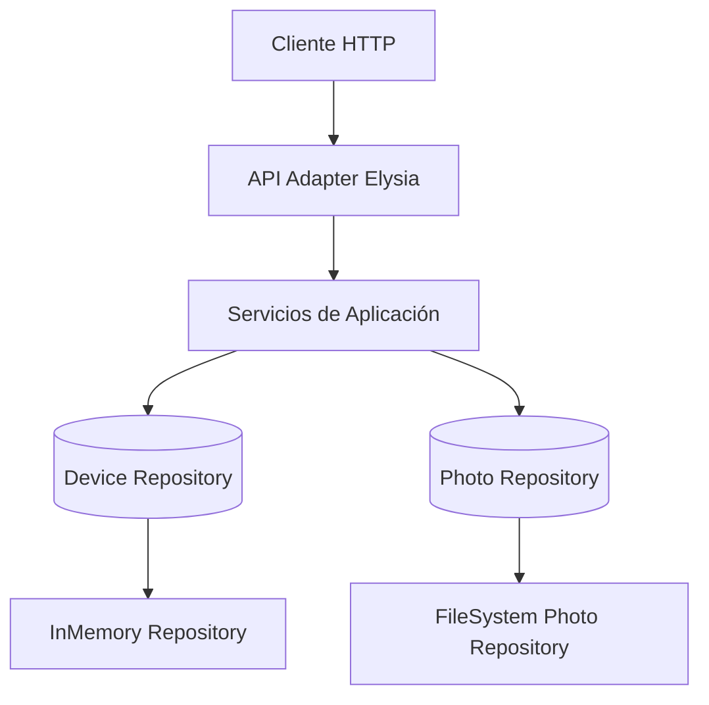

# Proyecto: Gestión de Dispositivos (Computadoras y Equipos Médicos)

## 1. URL de la página

> Nota: Incertar la URL real de tu despliegue en Azure.

## 2. Descripción del proyecto

Aplicación API REST construida en TypeScript para registrar y gestionar dispositivos físicos: computadoras y equipos médicos. Permite el check-in y check-out de dispositivos, registro de "computadoras frecuentes", subida y exposición de fotos y listados filtrables.

### Librerías / dependencias clave (visibles en `package.json`):

- `elysia` (framework HTTP)
- `@elysiajs/openapi` (generación OpenAPI)
- `zod` (validación de esquemas)
- `@axiomhq/js` (logging y monitoreo)
- `bun-types` (tipos para Bun runtime)
- `drizzle-orm` y `drizzle-kit` (preparado para persistencia SQL)
- `better-auth` (presente en dependencias — usado si se integra autenticación)

Tecnologías: TypeScript, Bun (runtime recomendado), Elysia, Zod.

## 3. Estructura del proyecto (principales carpetas)

Ejemplo de árbol (carpeta `src/`):

```
src/
├─ adapter/
│  ├─ api/
│  │  └─ elysia/
│  │     ├─ controller.elysia.ts
│  │     ├─ elysia.api.ts
│  │     ├─ criteria.helper.ts
│  │     └─ index.ts
│  ├─ logging/
│  │  ├─ axiom.config.ts
│  │  ├─ axiom.logger.ts
│  │  └─ axiom.middleware.ts
│  ├─ photo/
│  │  └─ filesystem/
│  │     ├─ filesystem.photo-repository.ts
│  │     ├─ filesystem.photo-repository.test.ts
│  │     └─ index.ts
│  └─ repository/
│     └─ inmemory/
│        ├─ inmemory.device-repository.ts
│        ├─ inmemory.device-repository.test.ts
│        └─ index.ts
├─ core/
│  ├─ domain/
│  │  ├─ computer.domain.ts
│  │  ├─ medical-device.domain.ts
│  │  ├─ shared.domain.ts
│  │  ├─ criteria.domain.ts
│  │  └─ index.ts
│  ├─ dto/
│  │  ├─ computer-request.dto.ts
│  │  ├─ medical-device-request.dto.ts
│  │  └─ index.ts
│  ├─ repository/
│  │  ├─ device.repository.ts
│  │  ├─ photo.repository.ts
│  │  └─ index.ts
│  ├─ service/
│  │  ├─ computer.service.ts
│  │  ├─ medical-device.service.ts
│  │  ├─ device.service.ts
│  │  ├─ logging.service.ts
│  │  ├─ error.ts
│  │  ├─ helper.ts
│  │  └─ index.ts
│  ├─ utils/
│  │  ├─ validation-schema.util.ts
│  │  ├─ error-base.util.ts
│  │  └─ index.ts
│  └─ constants.ts
├─ index.ts
└─ index.test.ts
```

## 4. Explicación de las carpetas (qué contiene y lógica)

- `adapter/`:
  - Contiene adaptadores externos (puertas) que conectan el núcleo con el mundo exterior.
  - `adapter/api/elysia/`: Configuración HTTP y rutas. Aquí está el `Controller` que define los endpoints y adapta solicitudes a los servicios.
  - `adapter/logging/`: Implementación del sistema de logging usando Axiom para monitoreo y observabilidad.
  - `adapter/repository/`: Implementaciones concretas de la interfaz `DeviceRepository` (por ejemplo, in-memory). Cambia según persistencia.
  - `adapter/photo/filesystem`: Implementación para almacenar y servir fotos desde el filesystem (útil en pruebas y entornos simples).

- `core/`:
  - Núcleo de negocio (dominio y servicios).
  - `core/domain/`: Tipos y modelos de dominio (`Computer`, `MedicalDevice`, `FrequentComputer`, etc.). Evita primitivas cuando sea necesario.
  - `core/dto/`: DTOs y esquemas `zod` usados para validación de request/responses.
  - `core/repository/`: Contratos (interfaces) que definen operaciones sobre repositorios (`DeviceRepository`).
  - `core/service/`: Lógica de negocio (checkin, checkout, registro de frecuentes). Aquí se aplican reglas y se orquestan operaciones sobre repositorios y repos de fotos.
  - `core/utils/`: Utilidades compartidas como validaciones y manejo de errores.

- `templates/` / `static/` / `resources/`:
  - En este proyecto actual no hay una carpeta `templates` ni `static` típica de aplicaciones MVC; el API es principalmente JSON. Si fueran añadidas, `templates/` contendría vistas (Thymeleaf/HTML) y `static/` assets públicos.

- `application.properties`:
  - No se usa en este proyecto (propio de aplicaciones Java/Spring). En su lugar, la configuración se maneja con variables de entorno o constantes en `src/`.

## 5. Configuración y entorno

### Variables de entorno

El proyecto utiliza las siguientes variables de entorno:

- `PORT` — puerto principal de la aplicación (por defecto 3000 en desarrollo, 443 en producción)
- `MEDIA_PORT` — puerto para el servidor de archivos de fotos (por defecto 8081 en desarrollo, 8443 en producción)
- `AXIOM_TOKEN` — token para el servicio de logging Axiom
- `AXIOM_DATASET` — nombre del dataset en Axiom
- `NODE_ENV` — entorno de ejecución (development/production)
- `PHOTO_BASE_URL` — URL base para servir fotos en producción

### Configuración de puertos

- Puerto principal: `3000` en desarrollo, `443` en producción
- Puerto de fotos: `8081` en desarrollo, `8443` en producción
- En Azure, el puerto se configura automáticamente mediante la variable `PORT`

### Ejemplo de archivo .env

```env
# Configuración de Axiom (reemplaza con tus credenciales reales)
AXIOM_TOKEN=xaat-6e34e7b4-4835-4bd7-ab2a-5292a857730a
AXIOM_DATASET=proyecto_final

# Configuración del servidor de medios
MEDIA_PORT=8083

# Configuración general
NODE_ENV=production
```

## 6. Cómo ejecutar el proyecto

### Requisitos previos:

- Instalar Bun (runtime recomendado)
- En Windows se recomienda usar WSL si Bun no está disponible nativamente

### Pasos (PowerShell, Windows):

1. Clona el repositorio:

```powershell
git clone <repo-url>
cd Proyecto_final
```

2. Instala dependencias (Bun):

```powershell
bun install
```

3. Ejecutar en desarrollo (con recarga):

```powershell
bun run dev
```

4. Abrir la API (por defecto):

http://localhost:3000/openapi

5. Ejecutar tests (si usas Bun test runner):

```powershell
bun test
```

### Comandos útiles:

- Para ejecutar en modo desarrollo con configuración específica:
  ```powershell
  $env:NODE_ENV="development"; $env:MEDIA_PORT="8081"; bun run dev
  ```

### Notas para producción / despliegue en Azure:

- Construir imagen Docker (si usas Dockerfile incluido) y desplegar en Azure Web App o Azure Container Instances / AKS.
- Asegúrate de definir variables de entorno (`PORT`, credenciales DB, `PHOTO_BASE_URL`).

### Ejemplo básico (Docker + Azure):

1. Construir imagen:

```powershell
docker build -t proyecto_final:latest .
```

2. Push a registry (ej. Azure Container Registry) y desplegar en Azure App Service o AKS.

## 7. Endpoints / peticiones disponibles

Rutas principales expuestas por `Controller` (`src/adapter/api/elysia/controller.elysia.ts`):

| Feature | Ruta | Método | Descripción |
|---------|------|--------|-------------|
| Computers - checkin | `/api/computers/checkin` | POST | Check-in de una computadora (multipart/form-data con foto) |
| Frequent computer - register | `/api/computers/frequent` | POST | Registrar una computadora frecuente (devuelve URLs de checkin/checkout) |
| Frequent computers - list | `/api/computers/frequent` | GET | Listar computadoras frecuentes |
| Computers - list | `/api/computers` | GET | Listar computadoras (con filtros via query criteria) |
| Medical devices - checkin | `/api/medicaldevices/checkin` | POST | Check-in de dispositivos médicos (multipart/form-data con foto) |
| Medical devices - list | `/api/medicaldevices` | GET | Listar dispositivos médicos |
| Entered devices | `/api/devices/entered` | GET | Listar dispositivos con estado "entered" |
| Frequent checkin (by id) | `/api/computers/frequent/checkin/:id` | PATCH | Check-in para una frequent computer (usa id UUID) |
| Device checkout | `/api/devices/checkout/:id` | PATCH | Checkout de un dispositivo por id (UUID) |

### Formato de requests importantes:

- `POST /api/computers/checkin` y `POST /api/computers/frequent`: `multipart/form-data` con campos `brand`, `model`, `ownerName`, `ownerId` y `photo`.
- `POST /api/medicaldevices/checkin`: `multipart/form-data` con `brand`, `model`, `ownerName`, `ownerId`, `serial`, y `photo`.

### Filtros y ordenamiento:

Los endpoints GET soportan filtros y ordenamiento mediante parámetros query:

- `sortBy`: Campo por el cual ordenar (ej. `brand`, `model`, `checkinAt`)
- `sortOrder`: Dirección del ordenamiento (`asc` o `desc`)
- `filterBy`: Campo por el cual filtrar (ej. `brand`, `model`)
- `filterValue`: Valor del filtro
- `limit`: Número máximo de resultados
- `offset`: Desplazamiento para paginación

## 8. Arquitectura del proyecto

Este proyecto sigue el patrón de Arquitectura Hexagonal (Ports & Adapters). Resumen:

- Core (Domínio + Servicios): contiene las reglas de negocio y contratos (`DeviceRepository`).
- Adapters: implementaciones concretas (HTTP controller, repositorios concretos, photo filesystem).

### Diagrama de arquitectura



### Diagrama de clases simplificado

```
                    +-------------------+
                    |    HTTP Client    |
                    +---------+---------+
                              |
                              v
                    +-------------------+
                    |  Adapter (Elysia) |  <- routing / validation (Controller)
                    +---------+---------+
                              |
                              v
                    +-------------------+
                    |   Application     |  <- Services (ComputerService, MedicalDeviceService)
                    |    Services       |
                    +----+--------+-----+
                         |        |
                         v        v
        +---------------+  +----------------+
        | DeviceRepo    |  | PhotoRepository|
        | (interface)   |  | (interface)    |
        +-----+---------+  +--------+-------+
              |                   |
 +----------+----+      +-------+---------+
 | InMemoryRepo   |      | FileSystemPhoto |
 +---------------+      +-----------------+
```